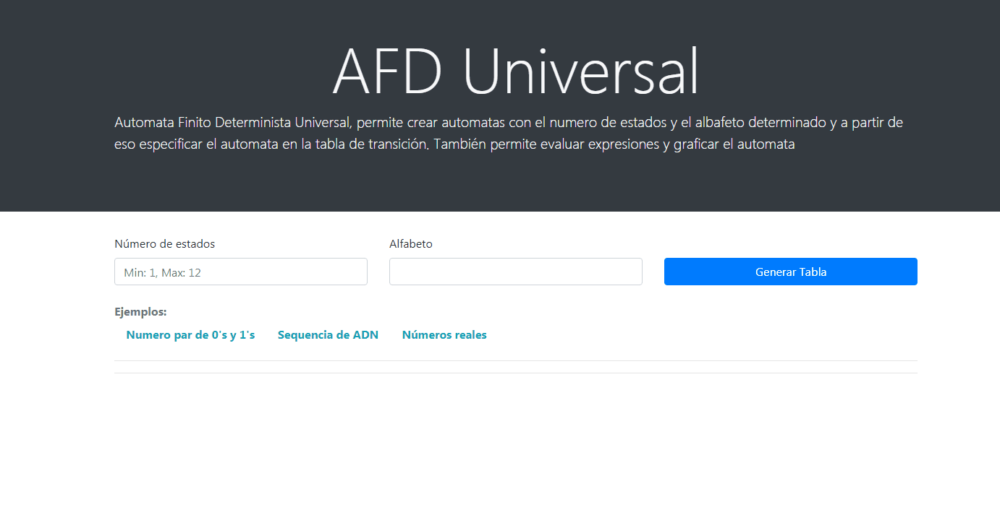
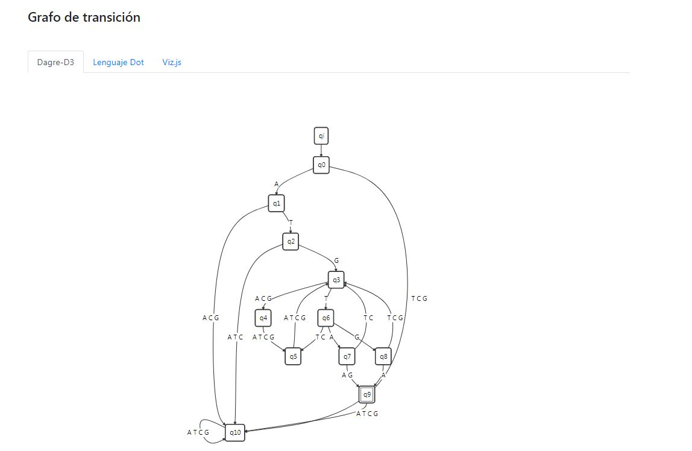

# Automata Determinista Finito Universal

Permite generar un AFD (Automata Finito Determinista) a partir de una tabla de transición de estados e ingresar expresiones para determinar su validez. También permite generar un grafo del automáta.

**Tecnologías y herramientas utilizadas:** HTML, CSS, JavaScript, Jquery, Dagre-D3, Visual Studio Code.

### Generar Grafo del automata

A traves de la libreria Dagre-D3 se genera un grafo del automata especificado.

