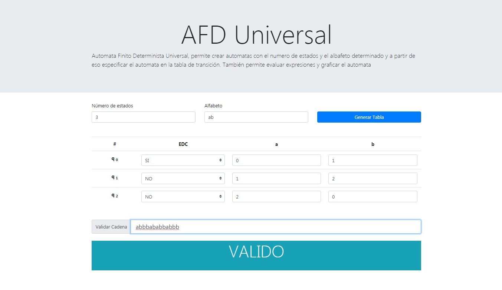

# Automata Determinista Finito Universal

Permite generar un ADF (Automata Finito Universal) a partir de una tabla de transición de estados e ingresar expresiones para determinar su validez.

También permite generar un grafo del automáta.

